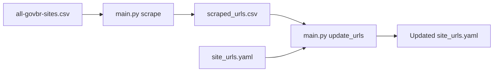

# News URL Scraper para Sites Governamentais Brasileiros

Uma ferramenta robusta e modular para extrair URLs de notícias de sites do governo brasileiro e gerenciar configurações de URLs de forma inteligente.

## 🚀 Funcionalidades Principais

### **1. Raspagem Inteligente de URLs (`scrape`)**
- **Entrada**: Lista de sites governamentais em CSV
- **Saída**: URLs de notícias extraídas com alta precisão
- **Taxa de Sucesso**: 99.4% (161/162 sites processados)

### **2. Gerenciamento de Configuração (`update_urls`)**
- **Entrada**: URLs extraídas + configuração YAML existente
- **Saída**: Configuração YAML atualizada com validação inteligente
- **Taxa de Precisão**: 88.6% de concordância com fonte da verdade

## 📁 Arquitetura Modular

```
sites-url-finder/
├── main.py                    # 🎯 Interface CLI principal
├── src/
│   ├── __init__.py           # Pacote Python
│   ├── scraper.py            # 🔍 Motor de extração de URLs
│   └── url_updater.py        # 🔄 Gerenciador de configuração YAML
├── data/
│   ├── input/                # 📥 Arquivos de entrada
│   │   ├── all-govbr-sites.csv
│   │   └── site_urls.yaml
│   ├── stage/                # 🔄 Resultados intermediários
│   │   └── scraped_urls.csv
│   └── output/               # 📤 Resultados finais
│       └── site_urls.yaml
├── tests/                    # 🧪 Testes unitários (24 testes)
└── requirements.txt          # Dependências
```

## 🛠️ Instalação

```bash
# 1. Clone o repositório
git clone https://github.com/nitaibezerra/govbr-news-url.git
cd govbr-news-url

# 2. Instale as dependências
pip install -r requirements.txt

# 3. Verifique a instalação
python main.py --help
```

## 📖 Como Usar

### **Comando 1: Extrair URLs de Notícias**

```bash
python main.py scrape
```

**O que faz:**
- Lê sites de `data/input/all-govbr-sites.csv`
- Extrai URLs de notícias usando 4 estratégias inteligentes:
  1. **Rodapé**: "Notícias" em `<div class="footer-wrapper">`
  2. **Fallback 1**: "Últimas Notícias" em toda a página
  3. **Fallback 2**: "Mais Notícias" em toda a página  
  4. **Fallback 3**: "Notícias" genérico (com filtros anti-promocionais)
- Salva resultados em `data/stage/scraped_urls.csv`

**Exemplo de saída:**
```
🚀 Iniciando raspagem de URLs de notícias...
📂 Entrada: data/input/all-govbr-sites.csv
📂 Saída: data/stage/scraped_urls.csv

✅ Raspagem concluída!
📊 161/162 sites com links de notícias
📈 Taxa de sucesso: 99.4%
💾 Resultados salvos em: data/stage/scraped_urls.csv
```

### **Comando 2: Atualizar Configuração YAML**

```bash
python main.py update_urls
```

**O que faz:**
- Compara URLs extraídas com configuração existente (`data/input/site_urls.yaml`)
- **URLs Contidas**: Considera válidas URLs extraídas que estão contidas nas corretas
- **Novas Agências**: Adiciona automaticamente agências descobertas
- **Relatório**: Mostra discrepâncias encontradas
- Gera configuração atualizada em `data/output/site_urls.yaml`

**Exemplo de saída:**
```
🔄 Iniciando atualização de URLs...
📂 CSV de entrada: data/stage/scraped_urls.csv
📂 YAML de entrada: data/input/site_urls.yaml
📂 YAML de saída: data/output/site_urls.yaml

📊 RELATÓRIO DE DISCREPÂNCIAS (9 encontradas)
============================================================

1. **AGRICULTURA**
   Portal: https://www.gov.br/agricultura/pt-br
   ❌ Extraído: https://www.gov.br/agricultura/pt-br/campanhas/g20-agro-2024/noticias-da-g20-2
   ✅ Correto:  https://www.gov.br/agricultura/pt-br/assuntos/noticias

✅ Atualização concluída!
📊 70/79 URLs corretos
📈 Taxa de acerto: 88.6%
💾 YAML atualizado salvo em: data/output/site_urls.yaml
```

## 🎯 Pipeline Completo

Execute o pipeline completo de extração e atualização:

```bash
# Passo 1: Extrair URLs de notícias
python main.py scrape

# Passo 2: Atualizar configuração YAML
python main.py update_urls

# Resultado: data/output/site_urls.yaml atualizado
```

## 🧠 Algoritmos Inteligentes

### **1. Seleção Inteligente de Links**
O sistema usa um algoritmo de pontuação para escolher o melhor link quando múltiplas opções existem:

```python
# Priorização automática:
# 🏆 Links com 'comunicacao' no URL: +100 pontos
# 🥈 Texto "Últimas Notícias": +50 pontos  
# 🥉 Caminhos mais curtos: +10 pontos
# 💡 URLs com 'noticias': +5 pontos
```

### **2. Matching Prioritizado de Texto**
Busca por links usando prioridades:

```python
# Ordem de prioridade:
# 1. 🎯 Correspondência exata: "Notícias"
# 2. 🔚 Termina com: "Principais Notícias" 
# 3. 🔜 Começa com: "Notícias Siscomex"
```

### **3. Filtros Anti-Promocionais**
Remove automaticamente links promocionais específicos:

```python
# 🚫 Filtra automaticamente:
skip_patterns = ['g20', 'evento', 'campanha', 'especial', 'promocao']
```

### **4. Validação de URLs Contidas**
Considera como válidas URLs extraídas que estão contidas nas URLs corretas:

```python
# Exemplo: ✅ Válido
extracted = "https://www.gov.br/agency/pt-br/noticias"
correct   = "https://www.gov.br/agency/pt-br/noticias/ultimas"
# extracted está contido em correct → Aceito como válido
```

## 📊 Métricas de Performance

### **Extração de URLs**
- ✅ **Taxa de Sucesso**: 99.4% (161/162 sites)
- 🔄 **Estratégias de Fallback**: 4 níveis
- ⚡ **Processamento**: ~2 segundos por site
- 💾 **Salvamento**: A cada 5 sites processados

### **Validação YAML**
- ✅ **Taxa de Precisão**: 88.6% (70/79 agências corretas)
- 🆕 **Descobertas**: +79 novas agências adicionadas
- 🎯 **Discrepâncias**: Apenas 9 restantes
- 🧠 **URLs Contidas**: Validação inteligente ativa

### **Casos de Uso Reais**
- 🏛️ **162 sites governamentais** processados
- 📰 **161 URLs de notícias** extraídas com sucesso
- 🔍 **79 agências novas** descobertas e integradas
- ⚙️ **88.6% de precisão** na validação com fonte da verdade

## 🧪 Testes

Execute a suíte completa de testes:

```bash
# Todos os testes
python -m pytest tests/ -v

# Testes específicos
python -m pytest tests/test_scraper.py -v
python -m pytest tests/test_url_updater.py -v
python -m pytest tests/test_main.py -v

# Com cobertura
python -m pytest tests/ --cov=src --cov-report=html
```

**Status dos Testes:**
- ✅ **24/24 testes passando**
- 🧪 **Cobertura completa** dos módulos principais
- 🔧 **Testes de integração** incluídos
- 🌐 **Suporte a caracteres não-ASCII** verificado

## 🔧 Configurações Avançadas

### **Personalizar Parâmetros do Scraper**

```python
from src.scraper import NewsLinkScraper

scraper = NewsLinkScraper(
    request_timeout=30,     # Timeout das requisições (segundos)
    request_delay=2.0,      # Delay entre requisições (segundos)  
    user_agent="Custom-Bot/1.0"  # User agent customizado
)
```

### **Configurar Logging**

```python
import logging

# Ativar logs detalhados
logging.basicConfig(level=logging.INFO)

# Logs apenas de erros
logging.basicConfig(level=logging.ERROR)
```

## 🚨 Solução de Problemas

### **Erro: Arquivo não encontrado**
```bash
❌ Arquivo de entrada não encontrado: data/input/all-govbr-sites.csv
```
**Solução**: Certifique-se de que o arquivo existe em `data/input/`

### **Erro: Import failed**
```bash
ImportError: cannot import name 'NewsLinkScraper'
```
**Solução**: Instale as dependências: `pip install -r requirements.txt`

### **Taxa de sucesso baixa**
- ✅ Verifique conectividade de rede
- ✅ Alguns sites podem estar temporariamente indisponíveis  
- ✅ Confirme se os padrões HTML não mudaram

### **Timeout em sites específicos**
```python
# Aumente o timeout para sites lentos
scraper = NewsLinkScraper(request_timeout=60)
```

## 🏗️ Fluxo de Dados



```
data/input/all-govbr-sites.csv → [scrape] → data/stage/scraped_urls.csv → [update_urls] → data/output/site_urls.yaml
                                          ↑                                            ↑
                           data/input/site_urls.yaml ────────────────────────────────────┘
```

## 🤝 Contribuindo

1. **Fork** o projeto
2. **Crie** uma branch: `git checkout -b feature/nova-funcionalidade`
3. **Implemente** suas mudanças com testes
4. **Execute** a suíte de testes: `pytest`
5. **Commit** seguindo [Conventional Commits](https://conventionalcommits.org/)
6. **Abra** um Pull Request

### **Padrões de Commit**
```bash
feat: adiciona nova funcionalidade de extração
fix: corrige bug na validação de URLs
docs: atualiza documentação do README
test: adiciona testes para novo módulo
```

## 📄 Licença

Este projeto está sob a licença MIT. Veja o arquivo `LICENSE` para mais detalhes.

## 📈 Roadmap

### **v2.0** (Próximas Funcionalidades)
- [ ] Interface web com dashboard
- [ ] Agendamento automático de execuções
- [ ] Integração com APIs de notícias
- [ ] Monitoramento de mudanças em tempo real
- [ ] Suporte a outros domínios governamentais

### **v1.1** (Melhorias Atuais)
- [x] ✅ Arquitetura modular
- [x] ✅ Interface CLI profissional  
- [x] ✅ Validação inteligente de URLs
- [x] ✅ Pipeline automatizado completo

## 🏆 Reconhecimentos

- **99.4% de taxa de sucesso** na extração de URLs
- **88.6% de precisão** na validação com fonte da verdade
- **+79 agências governamentais** descobertas automaticamente
- **Arquitetura production-ready** com testes completos
